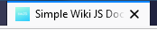
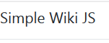
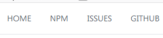
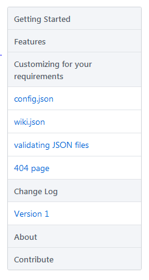

## Demo

Click [here](http://simplewikijs-env.uvxbzunvrr.ap-south-1.elasticbeanstalk.com/pages/getting-started) to see the demo

## Getting Started

### Using git

- Use the command `git clone https://github.com/melwinalm/simpleWikiJS.git` to create a copy of the repo on your local machine.

- Cd to the local directory, and run `npm install` to install all the npm packages.

- Once the packages are downloaded, use `npm start` to start the local server. You could also use `nodemon start` if you have nodemon installed on your local.

- Now open `localhost:3000` in your browser.

### Using npm 

- `npm install simplewikijs` to download the package.

- Once the packages are downloaded, use `npm start` to start the local server. You could also use `nodemon start` if you have nodemon installed on your local.

- Now open `localhost:3000` in your browser.

## Customizing the site

Make changes to config.json and wiki.json files to suite your requirements.

### Customizing config.json

This file defines the properties, templates and navigation information about the site.

Follow the following rules to edit config.json file.

- Main Settings



```json
"main": {
        "title": "Simple Wiki JS Documentation",
    },
```

`title` - Title of the page. This will remain same in every page, even when you navigate to other pages.

- Navigation Settings





```json
"navigation": {
        "title": "Simple Wiki JS",
        "items": [
            {"title": "HOME", "url": "/"},
            {"title": "NPM", "url": "https://npmjs.com/package/simplewikijs"},
            {"title": "ISSUES", "url": "https://github.com/melwinalm/simplewikijs/issues"},
            {"title": "GITHUB", "url": "https://github.com/melwinalm/simplewikijs"}
        ],
        "template": "navigation/navigation.ejs"
    },
```

`title` - Text to be displayed in the navigation bar.

`items` - This is an array of objects, each object containing information about navigation item.

`template` - Specifies the design template for navigation bar. Customize existing ones or create new ones in this folder  - `\templates\navigation\`.

`title` - Text to be displayed for the navigation item.

`url` - URL of the navigation item.

- Wiki Settings

```json
"wiki": {
        "template": "wiki/wiki.ejs",
        "defaultfolder": "pages"
    },
```

`template`- Specifies the design template for wiki navigation. Customize existing ones or create new ones in this folder  - `\templates\wiki\`.

`defaultfolder` - Specifies the folder location where the content(MD) files are available.

- Content Settings

```json
"content": {
        "template": "content/content.ejs"
    },
```

`template` - Specifies the design template for content part. Customize existing ones or create new ones in this folder  - `\templates\content\`.

### Customizing wiki.json

This file defines the left navigation of the page. See the below image.



Follow the following rules to edit wiki.json file.

```json
{
    "homepageurl": "getting-started"
```

`homepageurl` - Specifies the default page url of the site. The value of this key should always be be part of items array in wiki.json file.

```json
"items": [
        {
            "title": "Getting Started",
            "url": "getting-started",
            "filelocation": "getting-started.md",
            "subitems": [
                {
                    "title": "Installation",
                    "url": "installation",
                    "filelocation": "installation.md"
                },
```

`items` and `subitems` - Should be an array of objects. This defines the structure of wiki navigation present on the top-left of every page.

`title` - Title of display name of the page.

`url` - Any random string can be used here. This string will be used in the url bar on navigating to this item page. This url value is used in the `homepageurl` key discussed above.

`filelocation` - name of the markdown file, to be rendered on the page.

### Validating JSON files

Once all the changes are done, run the command `node validate.js` to validate the config files, errors will be logged to the console. Fix the errors accordingly and re-run the command. Once all the errors are fixed go ahead and start the server.

### Customizing 404 page

Navigate to `templates` folder location and modify the 404.ejs file to customize the 404 page. The 404 page is designed using EJS (Embedded JavaScript). Learn more about the EJS templating engine [here](https://ejs.co/#docs).

## Contribute

There are no set of rules to be followed. If you want to make a contribution, just go ahead and create a pull request [here](https://github.com/melwinalm/simplewikijs/pulls). If you find that there is an issue, or want to request for a new feature, create a new issue [here](https://github.com/melwinalm/simplewikijs/issues). Always make sure that you provide proper information, screenhots etc. when contributing. 

I will make sure to respond to the issues and pull requests as soon as possible.

#### Happy open sourcing!!!